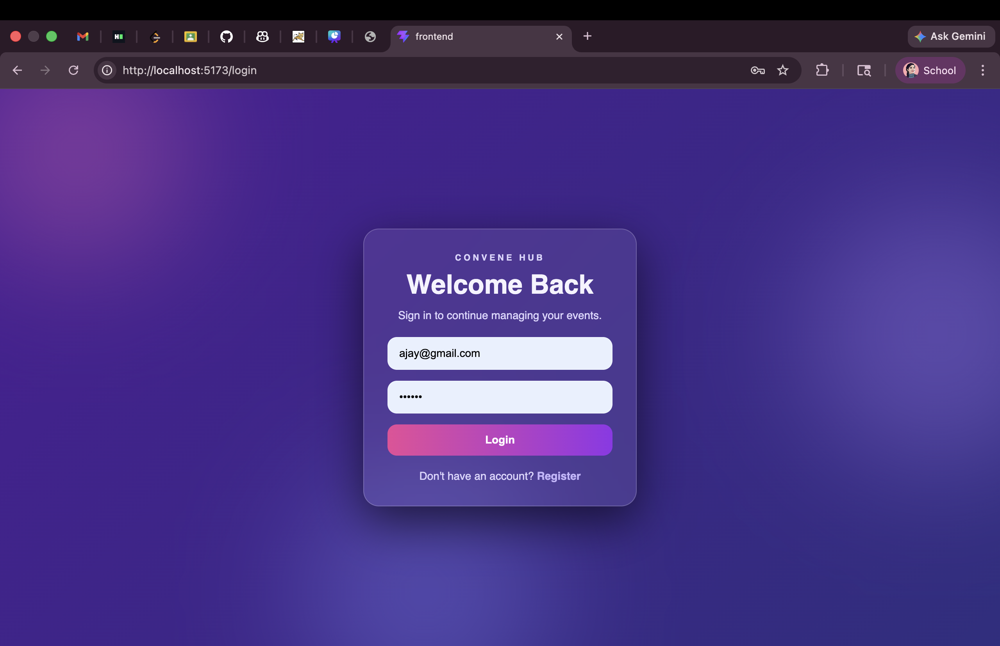
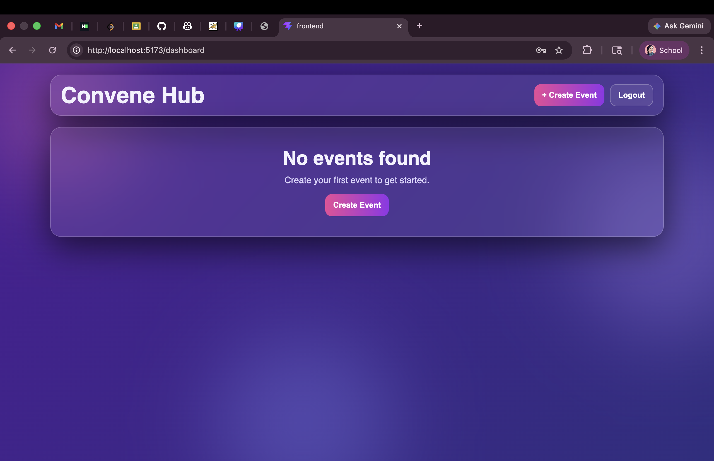
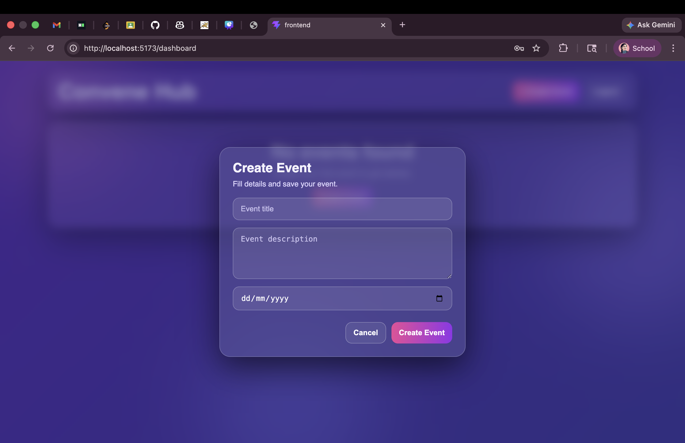

# 🚀 Convene Hub

**Convene Hub** is a modern full-stack event management web application where users can securely register, log in, and manage events (create, edit, delete) through a premium glassmorphism interface with elegant purple/indigo gradients.

It is built as a portfolio-ready MERN-style project with clean UI, secure authentication, and structured API design.

---

## ✨ Features

- 🔐 **User Authentication**
  - Register new users
  - Login with secure credentials
- 🛡️ **JWT-Based Authorization**
  - Protected event routes
  - Token-based API security
- 📅 **Event Management**
  - Create events
  - Edit events
  - Delete events
  - View all user events in dashboard
- 🎨 **Premium UI**
  - Glassmorphism cards
  - Purple/Indigo gradient aesthetics
  - Responsive layout for desktop/mobile
- 🗓️ **Date Handling**
  - Custom-styled date picker integration

---

## 🧰 Tech Stack

### Frontend
- **React.js** (Vite)
- **Custom CSS** (Glassmorphism UI)
- **React DatePicker**

### Backend
- **Node.js**
- **Express.js**
- **MongoDB** + **Mongoose**
- **JWT Authentication**

---

## 📁 Project Structure

```bash
Convene-Hub/
│
├── backend/
│   ├── controllers/
│   ├── middleware/
│   ├── models/
│   ├── routes/
│   └── server.js
│
├── frontend/
│   ├── src/
│   │   ├── Dashboard.jsx
│   │   ├── Login.jsx
│   │   ├── Register.jsx
│   │   ├── App.jsx
│   │   └── ui.css
│   └── ...
│
└── README.md
```

---

## ⚙️ Setup Instructions

## 1) Clone the repository

```bash
git clone https://github.com/your-username/convene-hub.git
cd convene-hub
```

## 2) Backend Setup

```bash
cd backend
npm install
```

Create a `.env` file in `backend/`:

```env
PORT=5000
MONGO_URI=your_mongodb_connection_string
JWT_SECRET=your_super_secret_jwt_key
```

Start backend server:

```bash
npm run dev
```

---

## 3) Frontend Setup

Open a new terminal:

```bash
cd frontend
npm install
npm run dev
```

Frontend runs on Vite default:
- `http://localhost:5173`

Backend runs on:
- `http://localhost:5000`

---

## 🔐 Environment Variables

Example `backend/.env`:

```env
PORT=5000
MONGO_URI=mongodb+srv://<username>:<password>@cluster.mongodb.net/convenehub
JWT_SECRET=your_jwt_secret_here
```

> ✅ Keep `.env` private and never push secrets to GitHub.

---

## 📡 API Endpoints

### Auth Routes

- `POST /api/auth/register` → Register user
- `POST /api/auth/login` → Login user

### Event Routes (Protected - JWT Required)

- `GET /api/events` → Get all events for logged-in user
- `POST /api/events` → Create new event
- `PUT /api/events/:id` → Update event
- `DELETE /api/events/:id` → Delete event

**Auth Header format:**
```http
Authorization: Bearer <token>
```

---

## 🖼️ Screenshots

> Add screenshots here after deployment / UI finalization.

- Login Page
- Register Page
- Dashboard
- Create Event Modal

Example markdown:
```md



```

---

## 🔮 Future Improvements

- 👥 Team-based event collaboration
- 🔔 Email / push reminders for events
- 📆 Calendar view (month/week/day)
- 🏷️ Event categories and filters
- 🌐 Deployment (Vercel + Render/Railway)
- 🧪 Unit and integration testing
- 📱 PWA/mobile app support

---

## 👨‍💻 Author

**Your Name**  
Full Stack Developer (MERN)

- GitHub: [https://github.com/your-username](https://github.com/your-username)
- LinkedIn: [https://linkedin.com/in/your-profile](https://linkedin.com/in/your-profile)

---

## 📄 License

This project is open-source and available under the **MIT License**.
